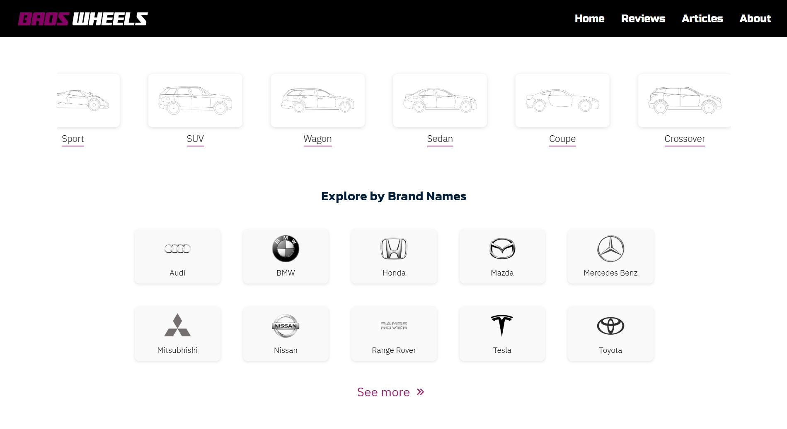

# Baos Wheels Web Project


Baos Wheels is a web application designed to provide users with an intuitive and seamless experience for exploring and purchasing wheels for their vehicles.





## Features

- Browse a wide selection of wheels.
- Filter and search for specific wheel types.
- View detailed product information.
- Add items to the cart and proceed to checkout.

## Technologies Used

- Frontend: [Specify the framework/library, e.g., React, etc.]
- Backend: Node.js with Express.js
- Styling: [CSS/SCSS/Tailwind/etc.]
- API: [Mention any APIs used]

## Getting Started

Follow these steps to set up the project locally:

### Prerequisites

- Node.js (vXX.X.X or higher)
- npm or yarn

### Installation

1. Clone the repository:
   ```bash
   git clone [repository-url]
   ```
2. Navigate to the project directory:
   ```bash
   cd d:\Baos_Wheels_webproject\frontend
   ```
3. Install dependencies:
   ```bash
   npm install
   ```

### Running the Application

To start the development server, run:
```bash
npm start
```
The application will be available at `http://localhost:3000`.

### Building for Production

To create a production build, run:
```bash
npm run build
```

## Contributing

Contributions are welcome! Please fork the repository and submit a pull request.

## License

[Specify the license, e.g., MIT License]

## Contact

For any inquiries, please contact [Your Contact Information].
